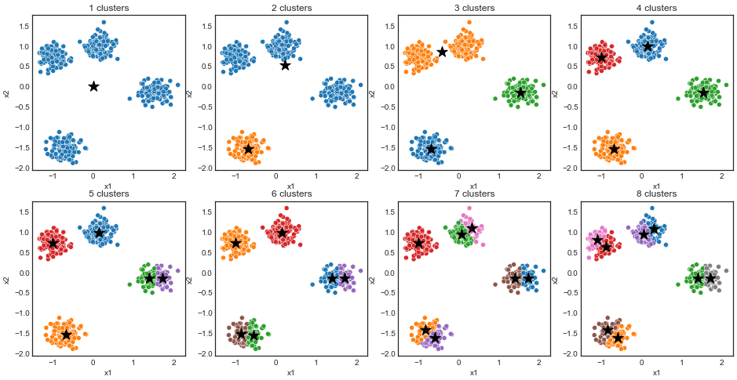

# K-Means

*K-means partitions data into k clusters by minimizing within-cluster variances.*

K-Means is an unsupervised learning method meaning that we have no labels in our data. Every new example (data point) is compared to all the previous ones. Then how do we classify our data points? Imagine that we know that there are three distinct groupings in our data. We can set k=3 and then K-Means will assign each observation into exactly three clusters. Instead of chosing the closest neighbours like KNN K-Means tries to minimise within-cluster variances. 

1. Pick a value for $k$
2. $k$ data points are randomly chosen as cluster centers
3. Each new data point is assigned to one of the $k$ clusters
4. The center of each cluster is recalculated
5. Repeat 3-4 until convergence

.  
In practice we can use an elbow plot to find the lowest value (sum of squared distances) for $k$ using some distance metric, i.e. the lower the distance the better. We can also use a silhouette plot that measures cluster tightness. 

We need to standardise the data so that different scales won't affect the distances. With standardised data the values are centered around zero. If we work with probabilities then we need to normalise as well.  