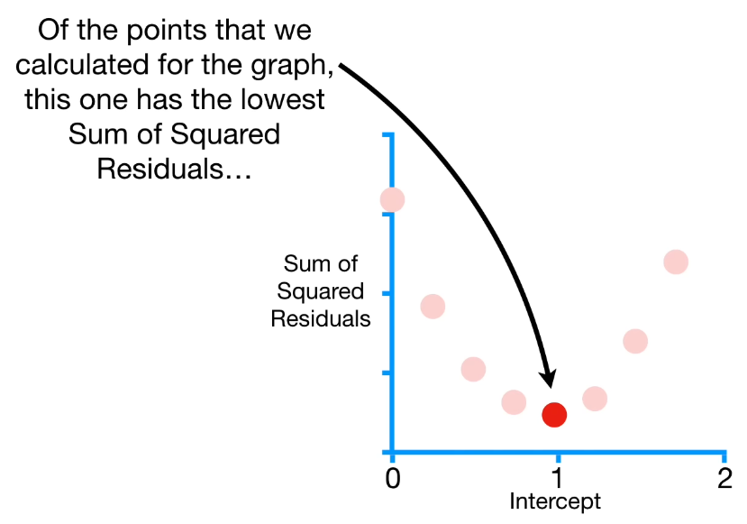

# Gradient Descent (aka Batch Gradient Descent)

*Gradient descent is an iterative optimization algorithm for finding the minimum of a function.*

$$ \text{SSE/SSR/RSS} = \sum^n_{i=1} (y_i - ŷ_i)^2 $$  

Like OLS, GD can try to minimise the SSE (one of several loss functions to optimise for). Imagine an optimisation of a linear regression. You have a scatter plot with data points and a line. If the line fits between the points so that it is close to the majority of them then the line is optimised. 

.
Now imagine that we know the slope of the line but not the intercept on the y axis. We can start with setting the intercept to zero and then go from there. If we would plot the SSE (y) as we increase the intercept (x) we would get a U-shape. Where the U-shape (SSE) is at it's lowest is where we'll find the optimum intercept value. 

.  
A very efficient but not optimal way of calculating this is with GD. It takes longer strides when far from the optimal solution but smaller steps as it gets closer (when the SSE doesn't change as much). 

$$ \bold{C(\theta)} = \frac{1}{n} \sum^n_{i=1} (y_i - \theta X_i)^2 $$  

Detta är en iterativ process och kan skrivas om såhär:  

$$ \theta_{j+1} = \theta_j - \eta \nabla \bold{C(\theta)} $$  
$$ \theta_{j+1} = \theta_j - \eta (\frac{2}{n} \bold{X^T} (\bold{X\theta_j - y})) $$  

How it works is by finding the derivative of the function for the U-shape to determine the slope at any value for the intercept. So for each data point it calculates the derivative and then insert a random number for, as used above, the intercept. What it actually does it do this for both the slope and the intercept. If there are more variables (higher dimensions) then each derivative will be calculated

$$ \text{step size} = \text{slope} \cdot \text{learning rate} $$  

Each step size of GD is determined by multiplying the slope (of the derivative) with the **learning rate**. Note that GD is very sensitive to the learning rate. Generally we start with relatively large values and move on to relatively smaller ones (aka schedule). With high learning rates regular GD will likely overshoot the minimum and potentially diverge (never converge) by either bouncing around or even increasing the error with each step. GD stops when the step size is very close to zero - which is when the slope is very close to zero as well. 

Two or more derivates of the same function is called a *gradient*. This gradient is used to *descend* to the lowest point in the *loss function* (in this example SSE), hence **gradient descent**.

### Steps (aka epochs)

1. take the derivative of the loss function for each parameter in it
2. pick random values for the parameters
3. plug the parameter values into the the gradient (the derivatices)
4. calculate step sizes
5. calculate the new parameters
6. repeat 3-5 until:
    - step size is very small (close to zero), or
    - maximum number of steps are reached

When you have fewer data points all this calculating doesn't take too much time but GD uses the entire dataset at each step. A more efficient way to do this is with stochastic gradient descent (SGD) or mini-batch gradient descent (mini-batch GD). 

## SGD and mini-batch GD
SGD uses a single random data point to calculate the derivatives. That can be very useful when there is redundancies in the data, e.g. clusters of data points. But an even better way to do this is using a mini-batch which uses a subset of random data points, balancing speed and stability. 

Another pro of these is that we can update the calculations with new data without having to calculate the whole thing again. Also mini-batch can be run on GPUs to calculate all derivatives simultaneously. 

$$ \text{OLS} = O(np^2) $$  
$$ \text{SGD} = O(n) $$  
$$ n,p ~ \epsilon ~ sample ~ size, ~ dimensions $$  