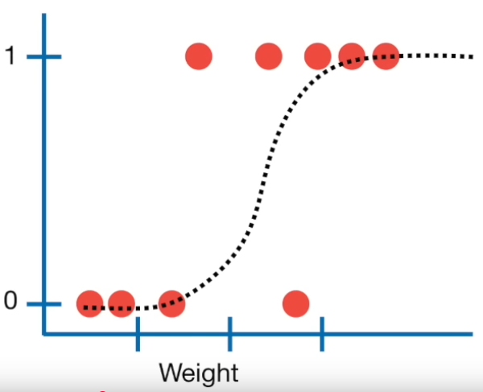

# Logistic Regression

*Despite its name, logistic regression is mainly a classification model that estimates the probability of a binary outcome.*

Though it sounds like a value regression model it is actually used for classifying since it predicts if something is True or False (binary) but it can work with other types of data, e.g. continuous and discrete and tell which variables that are useful and not. 

.  
The sigmoid curve tells the probability of class 1 based on the parameter on the x axis. In this case it predicts the probability of mice being obese (1) or not (0) using weight. In the middle of the curve there is a 50 % chance that a mouse is obese. Since this is used for classification then values >50 % will be classified as obese. 

$$ \frac{p(X)}{1-p(X)} = e^{\beta_0+\beta_1X} $$  

The left-hand side we call *odds*. If the odds are 1/4 that means 1 out of 5 succeeds:

$$ p = 0.2 $$  
$$ \frac{0.2}{1-0.2} = \frac{1}{4} $$  

In another example we can say that 9 out of 10 succeeds which would give us p=0.9 

$$ \log{\left(\frac{p(X)}{1-p(X)} \right)} = \beta_0 + \beta_1X $$  

When we use log it's called *logit odds*. 

$$ l(\beta_0, \beta_1) = \prod_{y_i = 1}p(x_i)\prod_{y_j=0}(1-p(x_j)) $$  

When log(odds) (instead of probability) are used (for continuous variables) the 0.5 value on the y-axis becomes zero and the old >0.5 are now zero to positive infinity and the other way around below 0.5. What this does is that it transforms the sigmoid line to a straight line again, like linear regression. Log(odds) can be converted back to probability and vice versa. 

*"The logarithm of the odds to belong in a certain class."* 

Since log(odds) use infinity values then SSE would also be infinite, therefore OLS can't be used. Instead we use maximum likelihood:

1. first project the data points onto the line
2. translate the log(odds) back to probabilities
3. calculate the log-likelihood
4. rotate the line
5. repeat 1-4 until the maximum likelihood has been found

## Evaluation
R² and p-value can be calculated here as well but there are multiple ways to do this and no concensus - it varies from field to field. There is one common way that is similar to R² in linear models though that might be a good general fit. 

## In practice
We generally need to scale the data for optimal performance and regularisation is often good. 