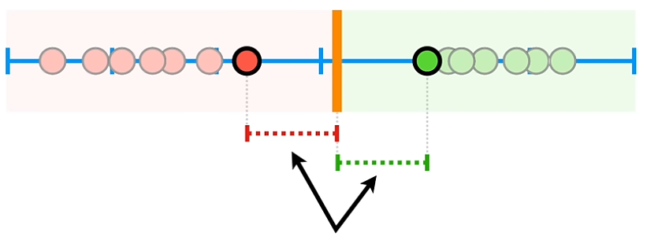
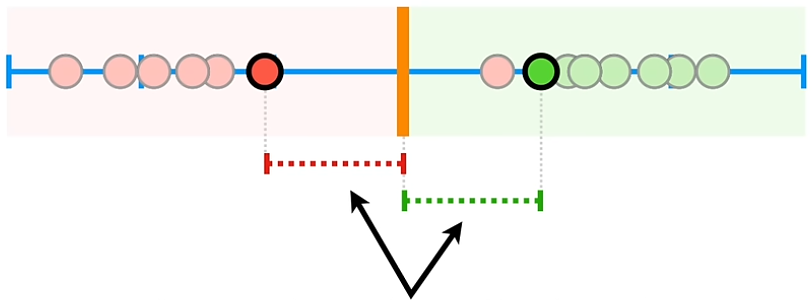

# Support Vector Machines

*SVMs find the optimal hyperplane that maximizes the margin between classes.*

## Maximum Margin Classifier (MMC)

.  
When classifying we want to separate classes from each other via a threshold (1D), line (2D), plane (3D) or hyperplane (>=4D). The **margin** is the distance between each class and the threshold. When that distance is the equal on both sides (in the case of two classes) the margin is as large as it can be, i.e. **maximum margin classifier**. However MMC is very sensitive to outliers (low bias) and will perform poorly to new data (high variance). 

## Soft Margin Classifier (SVC)

.  
Introducing more bias will allow for misclassification but will generalise better (lower variance). This is called a **soft margin**. The data points we use for calculating the margin (and those that fall inside the margin) are called **support vectors**. Which vectors are best? The bias/variance tradeoff is determined using cross validation. Soft margin classifiers are de facto **Support Vector Classifiers**. 

## Support Vector Machines (SVM)

.  
As seen above there are times when support vector classifiers can't fit a threshold without making a lot of misclassifications. To solve this SVMs move the data into higher dimensions and then separates them. SMVs use kernel functions to systematically find classifiers in higher dimensions. 

SVMs are basically a version of other techniques. A sigmoid kernel is at large logistic regression. The same goes for linear kernels, polynomial kernels etc. The difference is that we use a better optimising technique (soft margin) and we don't change our feature space. 

C is the hyperparameter used. Smaller values gives high variance + low bias and larger values gives low variance + high bias. 

### Some kernel functions

The **polynomial kernel** sets a degree (dimension) and transforms the data into that dimension and draws a hyperplane to separate the data. So if d=2 then the data will be on an quadratic line and a straight line can separate the data. The **radial kernel** finds SCVs in infinite dimensions. It however behaves like a weighted nearest neighbour model in that the closest observations have more influence on how we classify data. 

One important aspect to note is that **the kernel trick** allows SVMs to calculate high-dimensional relationships without actually transforming data to the higher dimension. This offer high performance and efficiency. SVMs don't actually need the exact coordinates of points in the higher-dimensional space. They only need to know the distances between points. Then the data is linearly separable but can be seen as complex in 2D. 

#### Poly

$$ (a \times b + r)^d $$  

$a$ and $b$ refers to two different observations in the dataset, $r$ determines the coefficient of the polynomial and $d$ sets the degree. To see how we can find the coordinates for data points in higher dimensions let's pick a random number for $r$ and let's use $d=2$. In practice the values for $r$ and $d$ are determined using cross validation.

$$ (a \times b + \frac{1}{2})^2 = ~~\text{(this is the kernel)} $$  
$$ = (a \times b + \frac{1}{2})(a \times b + \frac{1}{2}) $$  
$$ = ab + a²b² + \frac{1}{4} ~~\text{(this is the polynomial)} $$  
$$ = (a,a²,\frac{1}{2})\cdot(b,b²,\frac{1}{2}) ~~\text{(this is the dot product)} $$  

Now we have our X and Y coordinates for the higher dimension: $(a,a²)$ and $(b,b²)$. Since Z is a constant it can be ignored. The higher the value for $r$ the data points are shifted down along the x-axis before calculating the higher dimensinoal relationship. 

What's efficient about the polynomial kernel is that all we need to do to calculate the high dimensional relationship is plug in the values of each pair of data points into the kernel. For example, let's use the pair of $a=9$ and $b=14$. For simplicity we stick with the same numbers for $r$ and $d$.

$$ (9 \times 14 + \frac{1}{2})^2 = (126 + \frac{1}{2})^2 = 126.5^2 = 16,002.25 $$  

16,002.25 is one of the 2-dimensional relationships that we need to solve for the SVC even though we didn't actually transform the data to the higher dimension. SVM only stores the support vectors and collapses all other dimensions where these support vectors doesn't exist or are zero. 

#### RBF

$$ e^{-\gamma(a-b)^2} $$  

Remember that the radial kernel, also called the radial basis function (RBF), behaves like a weighted nearest neighbour model? What we mean by weighted is that the distance between each pair of data points ($a$ and $b$ just as before) is first squared and then multiplied with $\gamma$ (gamma). Gamma is determined through cross validation. 

$$ e^{-1(9 - 14)^2} = e^{-(-5)^2} = e^{-25} \approx 0 $$  
$$ e^{-1(2.5 - 4)^2} = e^{-(-1.5)^2} = e^{-2.25} = 0.11 $$  
$$ e^{-2(2.5 - 4)^2} = e^{-2(-1.5)^2} = e^{-2 \times 2.25} = 0.01 $$  

Here we can see that $\gamma$ scales the amount of influence two points have on each other. Also they need to be close neighbours to actually be influential as well. Just as with the polynomial kernel we get the higher-dimensional relationship between observations when we plug in the values. 

###### from resource
RBF kernels are effective for spiral data because they transform the data based on the distance between points (creating a Gaussian "bump" around each point), effectively mapping the spirals to a higher-dimensional space where they become linearly separable.