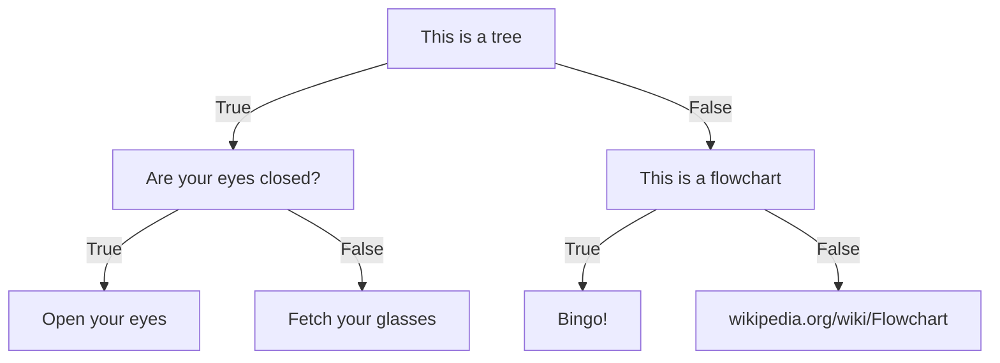

# Decision Trees (DT)

A *classification tree* classifies data while a *regression tree* (high bias, not really used) predicts numerical values. The top of the tree is called *the root* (ugh, I know), decisions further down are called *branches* (arrows pointing to and from) while the final statement are called *leaves* (no arrows pointing from). The number of levels to the tree is called *depth*. 

The root starts of with all the data and the data is then siphered through the branches until it reaches a leaf. In the example above we might have started with 15 people and ended up with sorting all people into a corresponding leaf. Then the leafs would be considered pure. Sometimes the leafs are impure meaning that the people in that leaf can still be split further. Impurity can be calculated with several functions, like entropy or gini. Entropy can be said to measure quality, therefore high entropy indicates a lot of noise. 

Since entropy decreases with depth we prefer to keep our trees small, like stumps, and since trees are linear we can split them up into smaller parts. 

DTs are very sensitive and prone to overfiting. Therefore we prefer smaller trees despite entropy decreasing with depth. One way to handle this other than splitting them up as suggested above is to *prune* leaves and branches - remove branches/leaves that that have little predicitive impact on the model. 

Another reason not to use DTs is if the relationship between the variables is roughly linear. Trees are generally better for more complex relationships as when the data is not linearly separable. They also mirror human decision making and is easy to interpret. It can also handle qualitative predictors without dummy variables. 

