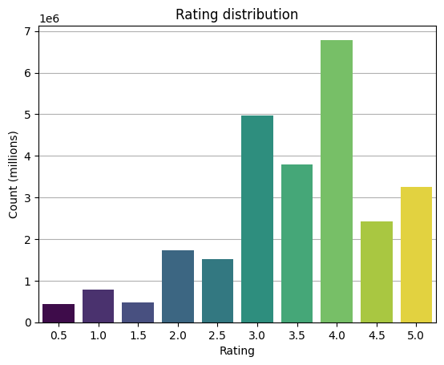
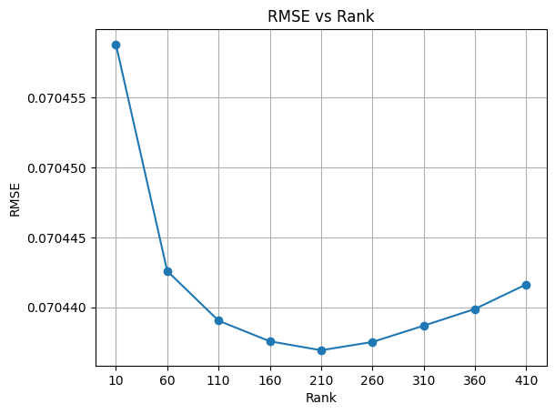
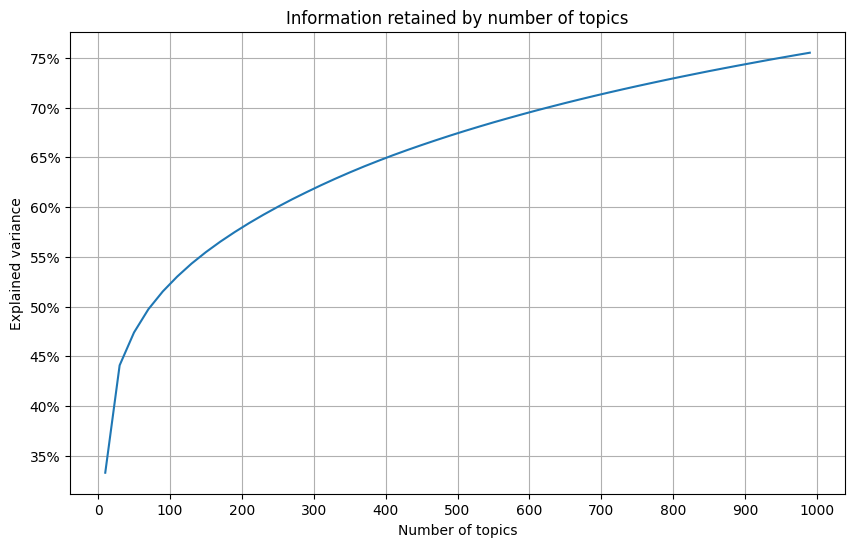

# Movie Recommendation System

This laboration is part of a machine learning course at [ITHS](https://www.iths.se), taught by [Raphael Korsoski](https://www.github.com/pr0fez). The purpose of the lab is to manipulate data from the the [movielens dataset](https://www.grouplens.org/datasets/movielens/) and through various methods create a system that, given an input, recommends a handful of movies. 

This system combines collaborative filtering and content-based filtering to provide personalised movie recommendations through a Streamlit application run locally. 

## Features

- Select favourite movies from a dropdown menu
- Get recommendations using two different methods:
  - Collaborative filtering 
  - Content-based filtering 
- Provide feedback on the recommendations and get a little movie nostalgia back

## How It Works

### Collaborative Filtering

This method mainly uses the ratings from the Movielens dataset. Since not all data points will be valuable for the model the data was filtered using quantiles to make sure that each datapoint added statistically meaningful information and that outliers wouldn't skew the model. This was accomplished by setting a minimum threshold and a maximum cap. 

 

The ratings are not normally distributed. Users rates differently and with varying amount of deviation. Therefore the ratings have been standardised per user and since this method will use a technique that can't handle negative values the ratings have also been normalised. 

 

These new ratings are then used to create a sparse user-movie matrix. The main model used is MiniBatchNMF (non-negative matrix factorisation). This model was chosen over the regular NMF model for it's efficiency using mini batch gradient descent. It is sensitive to which hyperparameters and values are used and since each iteration is randomised average values where set. The NMF algorithm is a decomposition technique that retains latent factors of the matrix in a lower dimension, i.e. it simplifies complex data. 

Rather than computing the dot product of these matrices of lower rank the cosine similarity was used instead as it provided better results. 

### Content-Based Filtering

This method combines the genres and tags of the Movielens dataset into one semantic corpus. The corpus needed to be cleaned so that the machine learning model could make sense of the data. For that the text was formatted, stemmed, stop words were removed and eventually vectorised into a TF-IDF matrix. 

 

On the topic of latent factors and dimensionality reduction this method uses the LSA algorithm (latent semantic analysis). Similar to NMF it identifies underlying topics and themes. The higher the number of topics the more information is retained. And once again cosine similarity was used for determining movies related to each other. 

## Installation

1. Download the dataset and place in the correct location (see below)
```
https://files.grouplens.org/datasets/movielens/ml-latest.zip
```
2. Install required packages:
```bash
pip install pandas numpy scipy scikit-learn nltk joblib streamlit
```
3. Run the training script:
```bash
python training.py
```
4. Launch the Streamlit app:
```bash
streamlit run main.py
```
5. Enjoy!

## Project Structure

When running the training script the joblib folders will be created if they don't already exist. However to maintain the proper structure the data folder and it's content needs to be manually created and stored following the structure below. 

```
.
├── data/
│   └── movielens/
│       ├── movies.csv
│       ├── ratings.csv
│       ├── tags.csv
├── movie_recommendation_system
    └── joblib/
    │   ├── collab/
    │   │   └── nmf_150.joblib
    │   └── content/
    │       ├── semantics.joblib
    │       └── lsa_950.joblib
    ├── collaborative_filtering.py
    ├── content_based_filtering.py
    ├── main.py
    ├── training.py
    └── README.md

```

## Limitations and improvements

- **Large data requirements**: The full dataset requires substantial memory which makes feature selection vitally important. Other choices than what were made here could impact performance. 
- **Hyperparameter optimisation**: Further tuning or dynamically chosing values might improve results but to make it easier they are pre-determined here. 
- **Computation time**: Matrix factorisation is computationally expensive while latent semantic analysis is way faster. Therefore to be a viable recommender system joblib was used. 
- **Model selection**: Both models used focus on latent factors which was the intention with this system. They can also be used as a baseline while other models are used on top which might increase performance. Also a hybrid model that combines approaches could be beneficial, especially for the end user. 